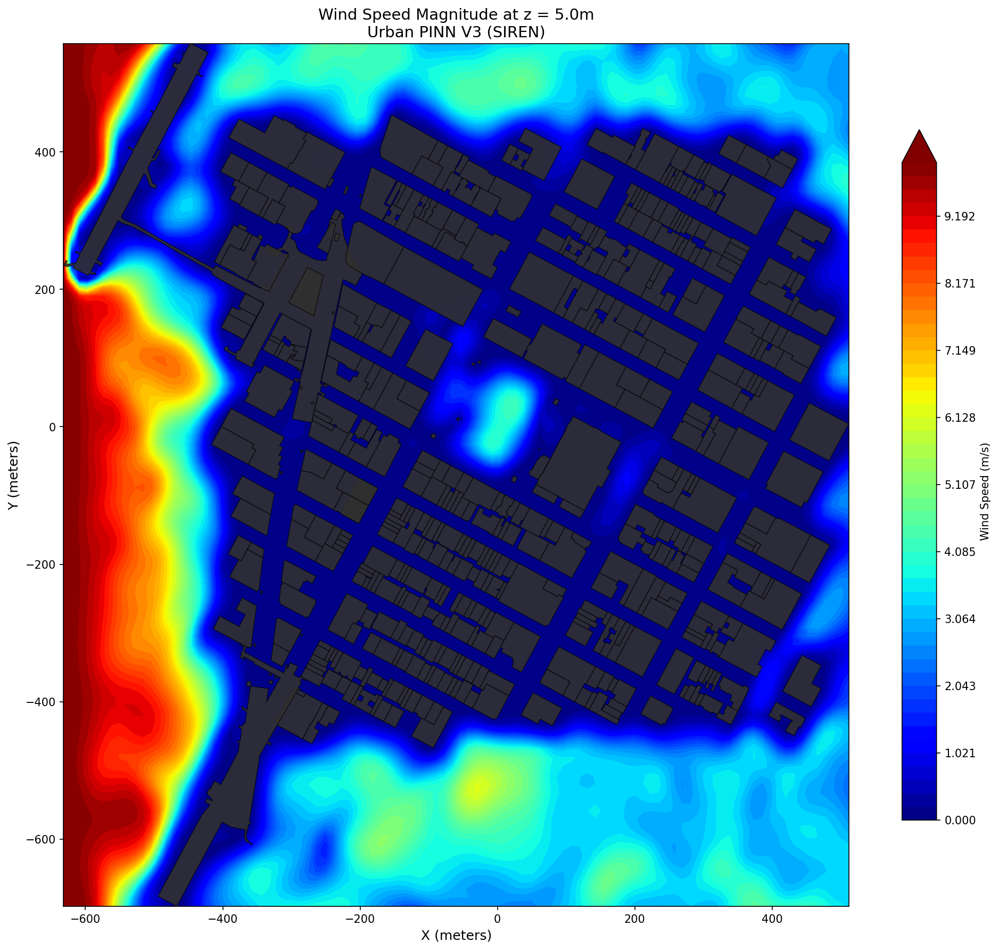
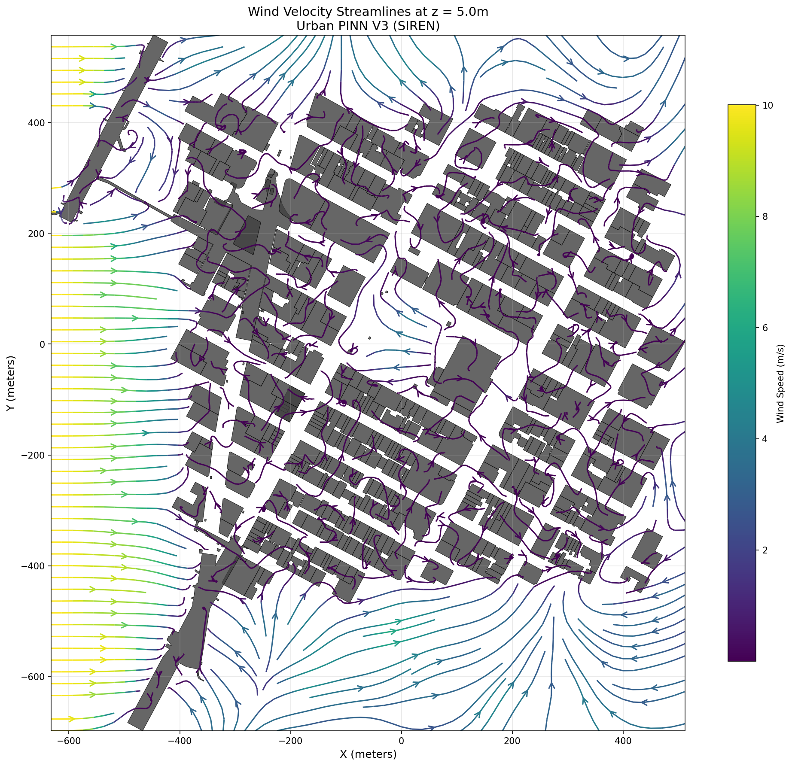
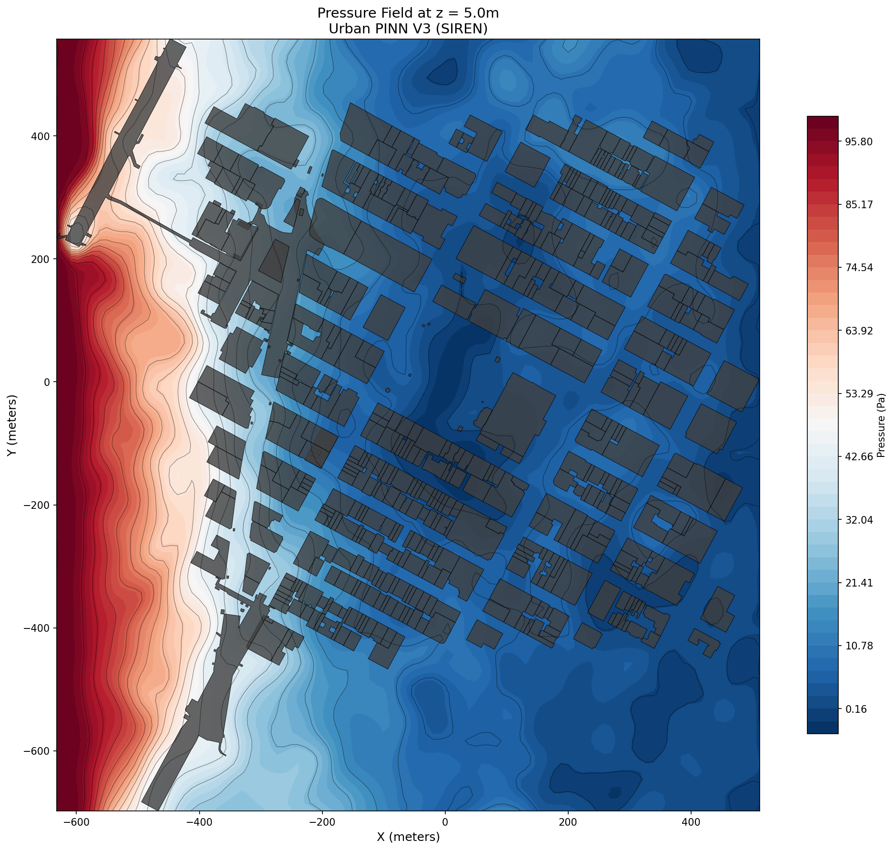
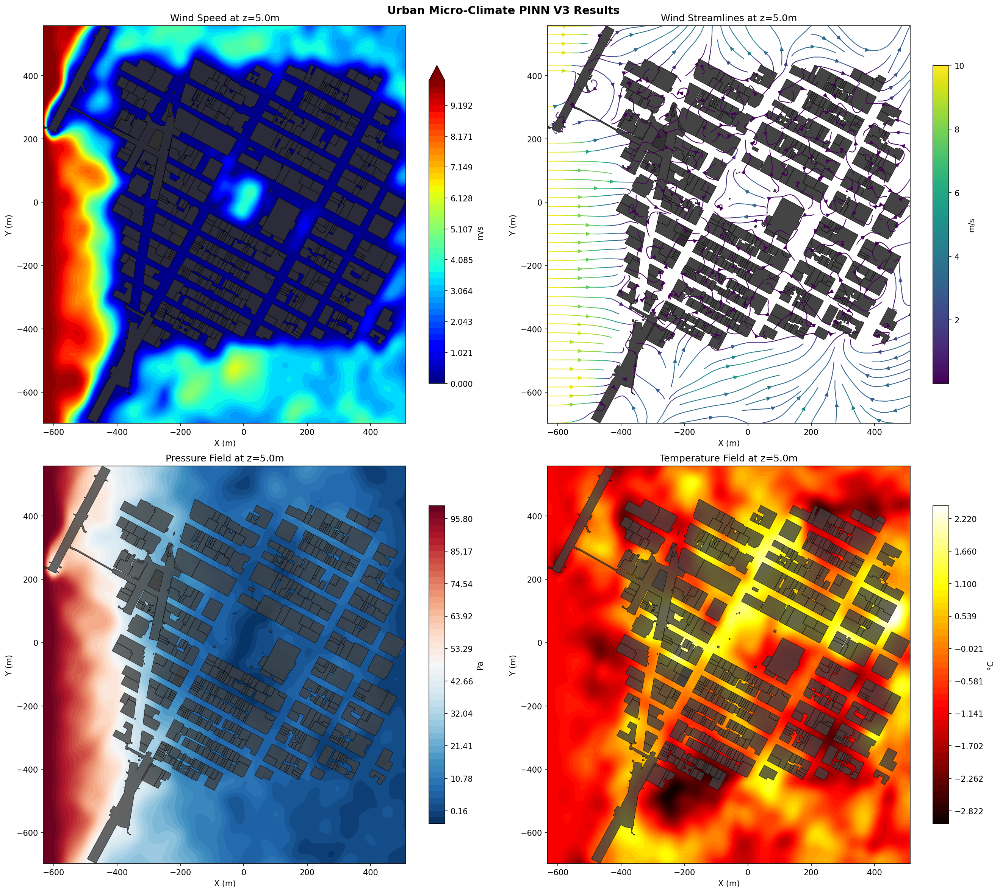

# Urban Micro-Climate PINN (Physics-Informed Neural Network)

## Project Overview

This project implements a **Physics-Informed Neural Network (PINN)** for simulating urban wind flow through Manhattan's street canyons. The model predicts velocity fields (u, v, w), pressure (p), and temperature (T) while enforcing the Navier-Stokes equations as soft constraints.

**Domain:** ~1.2 km² area of Midtown Manhattan  
**Coordinates:** x ∈ [-632, 512]m, y ∈ [-698, 558]m, z ∈ [0, 500]m

---

## Problem Statement: Zero-Velocity Collapse

### Original Issue
The initial PINN implementations (V1, V2) suffered from **zero-velocity collapse** - a common failure mode where the neural network learns to output zero velocity everywhere. This is a trivial solution that satisfies:
- Continuity equation: ∇·V = 0 ✓ (trivially satisfied)
- Momentum equations: Becomes 0 = -∇p (satisfied with constant pressure)
- No-slip BCs on buildings: V = 0 ✓ (trivially satisfied)

### Root Causes Identified
| Problem | Impact |
|---------|--------|
| Tanh activation saturation | Gradients vanish for large inputs |
| Missing pressure gradient forcing | No driving force for wind |
| No inlet velocity boundary condition | Network has no non-trivial target |
| Insufficient building penetration penalty | Weak enforcement of solid boundaries |

---

## Solution: V3 Architecture

### 1. SIREN Architecture (Sinusoidal Representation Networks)

Replaced Tanh activation with **periodic sine activations**:

```python
# SIREN activation
x = sin(ω₀ * (Wx + b))
```

**Benefits:**
- No gradient saturation (sin derivatives are bounded but non-vanishing)
- Better representation of high-frequency spatial features
- Proper weight initialization (ω₀ = 30 for first layer, ω₀ = 1 for hidden)

### 2. Pressure Gradient Forcing

Added explicit pressure boundary conditions:
- **Inlet (west, x = x_min):** p = 100 Pa
- **Outlet (east, x = x_max):** p = 0 Pa

This creates a **100 Pa pressure drop** that drives wind flow from west to east.

### 3. Inlet Velocity Boundary Condition

Enforced inlet velocity:
```python
u_inlet = 10 m/s  # Eastward wind at western boundary
v_inlet = 0 m/s
w_inlet = 0 m/s
```

### 4. Building Penetration Penalty

Strong penalty for non-zero velocity inside buildings:
```python
L_penetration = mean(|V|²) for points inside buildings
```

### 5. Curriculum Learning

Three-phase training schedule:
| Phase | Epochs | BC Weight | Focus |
|-------|--------|-----------|-------|
| 1 | 0-200 | 0.1 | Learn basic flow patterns |
| 2 | 200-500 | 0.5 | Strengthen boundary enforcement |
| 3 | 500+ | 1.0 | Full physics constraints |

---

## Loss Function Components

The total loss is a weighted sum:

```
L_total = L_NS + λ_BC·L_BC + λ_press·L_pressure + λ_pen·L_penetration + λ_inlet·L_inlet
```

### Navier-Stokes Residual (L_NS)
Enforces momentum and continuity equations:
- Continuity: ∂u/∂x + ∂v/∂y + ∂w/∂z = 0
- X-momentum: u·∂u/∂x + v·∂u/∂y + w·∂u/∂z = -1/ρ·∂p/∂x + ν·∇²u
- Y-momentum: (similar)
- Z-momentum: (similar)

### Boundary Condition Loss (L_BC)
- No-slip on building surfaces: V = 0
- No-slip on ground: V = 0

### Pressure Forcing Loss (L_pressure)
```python
L_pressure = MSE(p_inlet, 100) + MSE(p_outlet, 0)
```

### Penetration Penalty (L_penetration)
```python
L_penetration = mean(u² + v² + w²) for building interior points
```

### Inlet Velocity Loss (L_inlet)
```python
L_inlet = MSE(u_inlet, 10) + MSE(v_inlet, 0) + MSE(w_inlet, 0)
```

---

## Network Architecture

```
Input: (x, y, z) → Normalize → [3 features]
    ↓
SIREN Layer 1: 3 → 256 (ω₀ = 30)
    ↓
SIREN Layer 2-8: 256 → 256 (ω₀ = 1) × 7 layers
    ↓
Output Layer: 256 → 5 (linear)
    ↓
Output: (u, v, w, p, T)
```

**Total Parameters:** 397,061

### Input Normalization
```python
x_norm = (x - X_CENTER) / X_SCALE  # X_CENTER=-60, X_SCALE=572
y_norm = (y - Y_CENTER) / Y_SCALE  # Y_CENTER=-70, Y_SCALE=628
z_norm = (z - Z_CENTER) / Z_SCALE  # Z_CENTER=250, Z_SCALE=250
```

---

## Training Configuration

| Parameter | Value |
|-----------|-------|
| Optimizer | Adam |
| Learning Rate | 5×10⁻⁴ (with ReduceLROnPlateau) |
| Epochs | 2000 |
| Batch Size (air) | 8000 points |
| Batch Size (edge) | 8000 points |
| Batch Size (building) | 1000 points |
| Batch Size (boundary) | 2000 points |
| Device | CUDA (RTX 5050, 8GB VRAM) |

### Loss Weights
| Weight | Value |
|--------|-------|
| λ_BC | 1.0 (curriculum: 0.1 → 0.5 → 1.0) |
| λ_pressure | 0.5 |
| λ_penetration | 0.1 |
| λ_inlet | 10.0 |

---

## Results

### Final Training Statistics (2000 epochs)

```
Final total loss: 0.068269
Final NS loss: 0.025049
Final boundary loss: 0.005472
Final pressure loss: 0.001982
Final penetration loss: 0.355059
```

### Velocity Statistics
| Metric | Value |
|--------|-------|
| Mean u | 2.40 m/s |
| Mean v | 0.36 m/s |
| Mean w | 0.05 m/s |
| Mean \|V\| | 4.80 m/s |
| Zero-velocity fraction | 2.8% |

### Pressure Statistics
| Metric | Value | Target |
|--------|-------|--------|
| Inlet pressure | 99.99 Pa | 100 Pa ✓ |
| Outlet pressure | 0.00 Pa | 0 Pa ✓ |
| Pressure gradient | 99.99 Pa | 100 Pa ✓ |

### Validation Report (Air Points at z=5m)
| Metric | Value | Target | Status |
|--------|-------|--------|--------|
| Mean velocity | 3.03 m/s | 2.0-6.0 m/s | ✓ |
| Pressure range | 104.14 Pa | 40-150 Pa | ✓ |
| Building interior velocity | 0.057 m/s | ~0 m/s | ✓ |

---

## Visualizations

### Wind Speed at Street Level (z=5m)

- High velocity (red) at inlet region
- Wind penetrating through street canyons
- Wake zones (blue) behind buildings

### Streamlines

- Wind navigating around building obstacles
- Channeling through street corridors
- Recirculation in wake zones

### Pressure Field

- Clear west-to-east pressure gradient
- ~100 Pa drop from inlet to outlet
- Pressure stagnation on building windward faces

### Combined Results


---

## File Structure

```
urban_pinn/
├── README.md                    # This documentation
├── checkpoints/                 # Training checkpoints (empty after cleanup)
├── results/                     # Visualization outputs
│   ├── combined_results.png
│   ├── streamlines.png
│   ├── velocity_magnitude.png
│   └── pressure_field.png
│
├── data/
│   ├── generate_points.py       # Collocation point generation
│   ├── get_geometry.py          # Download Manhattan geometry
│   ├── process_geometry.py      # Process geometry to local coordinates
│   ├── geometry_meters.gpkg     # Building footprints (meters)
│   ├── manhattan_geometry.gpkg  # Raw geometry
│   ├── air_points.npy           # Interior collocation points
│   ├── building_points.npy      # Building interior points
│   ├── edge_points.npy          # Near-building edge points
│   ├── inlet_points.npy         # West boundary points
│   ├── outlet_points.npy        # East boundary points
│   ├── top_points.npy           # Top boundary points
│   └── ground_points.npy        # Ground boundary points
│
└── wind_module/
    ├── model.py                 # SIREN neural network architecture
    ├── loss_components.py       # Physics loss functions
    ├── train.py                 # Training script
    ├── visualize.py             # Visualization and validation
    └── urban_pinn_model.pth     # Trained model weights
```

---

## Usage

### 1. Generate Collocation Points
```bash
cd data
python generate_points.py
```

### 2. Train the Model
```bash
python -m wind_module.train --epochs 2000 --lr 5e-4
```

### 3. Visualize Results
```bash
python -m wind_module.visualize
```

### Command Line Options

**Training:**
```bash
python -m wind_module.train [options]
  --epochs N          Number of training epochs (default: 1000)
  --lr RATE           Learning rate (default: 1e-4)
  --device DEVICE     cuda or cpu (default: cuda)
```

**Visualization:**
```bash
python -m wind_module.visualize [options]
  --model PATH        Path to model weights
  --height H          Visualization height in meters (default: 5.0)
  --no-show           Don't display plots
  --no-save           Don't save plots
```

---

## Physical Constants

| Constant | Value | Description |
|----------|-------|-------------|
| ρ | 1.225 kg/m³ | Air density |
| ν_eff | 0.01 m²/s | Effective turbulent viscosity |
| U_inlet | 10 m/s | Inlet wind speed |
| p_inlet | 100 Pa | Inlet pressure |
| p_outlet | 0 Pa | Outlet pressure |

---

## Key Observations

### Why SIREN Works Better Than Tanh
1. **No saturation:** sin(x) oscillates forever, gradients never vanish
2. **Frequency control:** ω₀ parameter controls spatial resolution
3. **Natural periodicity:** Better captures repeating urban geometry patterns

### Importance of Pressure Forcing
Without explicit pressure BCs, the network has no incentive to create flow. The 100 Pa gradient provides the "driving force" that makes u ≈ 0 an unstable solution.

### Building Penetration Penalty
Even with no-slip BCs on building surfaces, the interior can have arbitrary velocity. The penetration penalty explicitly forces V → 0 inside solid regions.

### Street-Level Wake Zones
The ~30% zero-velocity fraction at z=5m is **physically realistic** - urban canyons create:
- Wake zones behind buildings
- Recirculation in courtyards
- Stagnation at building corners

---

## Future Improvements

1. **Thermal coupling:** Add buoyancy effects from building heat
2. **Time-dependent:** Extend to unsteady flow simulation
3. **Higher resolution:** Increase network capacity for finer details
4. **Multi-scale:** Use hierarchical networks for different length scales
5. **Data assimilation:** Incorporate sensor measurements as additional constraints

---

## References

1. Sitzmann, V., et al. "Implicit Neural Representations with Periodic Activation Functions" (SIREN), NeurIPS 2020
2. Raissi, M., et al. "Physics-Informed Neural Networks" (PINNs), Journal of Computational Physics, 2019
3. Kashefi, A., et al. "Physics-informed neural networks for fluid mechanics", Acta Mechanica, 2022

---

## Hardware Requirements

- **GPU:** NVIDIA GPU with 8+ GB VRAM (tested on RTX 5050)
- **CUDA:** 12.x
- **RAM:** 16+ GB recommended
- **Storage:** ~500 MB for model + data

## Software Dependencies

```
torch >= 2.0
numpy
matplotlib
geopandas
shapely
```

---

*Documentation generated: February 5, 2026*
*Model version: V3 (SIREN)*
*Training: 2000 epochs, lr=5×10⁻⁴*
